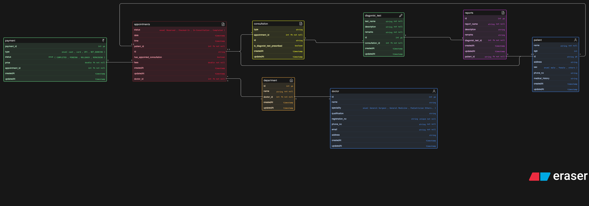

## Diagram

## Clinic Appointment System

A modern clinic wants to organize its operations digitally. They want to manage doctors, patients, appointments, consultations, diagnostic tests, reports, and payments. Patients should be able to visit doctors, book appointments, undergo tests if prescribed, and receive reports later.

The clinic may have multiple doctors across different departments or specialties. A patient may visit the clinic multiple times. During a visit, the doctor may prescribe one or more diagnostic tests. The diagnostic reports may be generated later and linked back to the patient and doctor visit.

Your task is to design the ER diagram for this clinic system.

This assignment is not about making a hospital-level giant system. Keep it focused on a clinic that handles appointments, consultations, diagnostics, and reporting in a clean and scalable way.

## Tasks

Your design should support questions like:

- Who are the doctors and what are their specialties?
- Which patient booked which appointment?
- What was the appointment status?
- Did the appointment result in a consultation?
- Were any diagnostic tests prescribed?
- What reports were generated?
- Can one patient have many visits?
- Can one doctor attend many patients?
- Can one consultation lead to multiple tests?
- How should payments be connected to visits or appointments?

## Soulution

-  One patient can hava many appointments
   - `patient.id < appointments.patient_id`
- One department can have many doctors
  - `department.doctor_id  < doctor.id`
- One doctor can visit many patient
  - `appointments.doctor_id < appointments.patient_id`
- Each appointment is assigned with one or multiple doctors 
  - `appointments.doctor_id < department.doctor_id`

- If one patient has multiple disease, then he would have multiple appointments
  - `appointments.id < consultation.appointment_id`
- One consultation can lead to multiple tests
  - `consultation.id < diagnostic_test.consultation_id`
- One test has only one report
  - `diagnostic_test.id = reports.diagnostic_test_id`
  - `reports.patient_id = patient.id`

- Each appointmets has its own payment
  - `appointments.id - patient.id`
  - `payment.price - appointments.fees`
