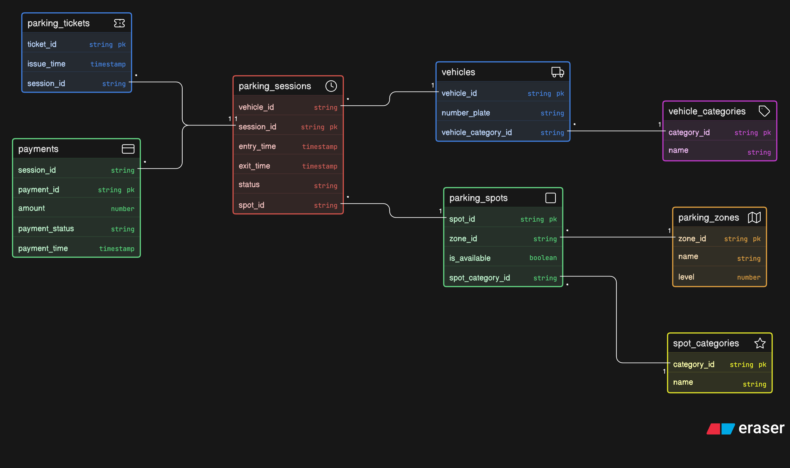

# Comic-Con India Parking System

## Entity Diagram


## Overview

A large convention venue hosts Comic-Con India, where thousands of visitors arrive across multiple days for anime screenings, cosplay competitions, gaming showcases, creator meetups, merchandise zones and panel discussions.

During the event, people arrive using **bikes**, **cars**, **SUVs**, **cabs**, and **EV vehicles**. The venue has a structured parking facility divided into multiple zones and levels. Some parking areas are reserved for cosplayers with props, exhibitors, creators, VIP guests, staff members, and EV charging vehicles.

Whenever a vehicle enters the parking facility, the system generates a parking ticket and assigns a suitable parking spot depending on vehicle type and availability. When the vehicle exits, the system records exit time and calculates the parking fee.

## System Requirements

The venue management wants a system that can track:

- Vehicles entering the parking facility
- Vehicle categories
- Parking spot allocation
- Reserved parking categories
- Entry and exit timestamps
- Parking sessions
- Payment status
- Spot availability across zones and levels

This is a multi-zone event parking system where vehicle types, access categories, sessions, tickets, and payments must be modeled properly.


## Design Questions

Your design should be able to answer the following questions:

- What vehicles entered the parking facility?
- What type of vehicle entered?
- Which parking spot was assigned?
- Which zone or level does that parking spot belong to?
- Was the parking spot reserved for exhibitors, VIP guests, staff, or EV charging?
- When did the vehicle enter the facility?
- When did the vehicle exit the facility?
- What ticket was issued for the parking session?
- Can one vehicle visit the venue multiple times across different days?
- Can one parking spot be reused across multiple parking sessions?
- How is parking availability tracked?
- How are parking charges calculated?
- How is payment recorded for each parking session?
- Can special access categories (cosplayers with props, exhibitors, VIP guests, staff) be represented?
- Can the system track which vehicles are currently parked inside the venue?


## Solution

1. Vehicle → ParkingSession
   - One vehicle can visit multiple times
   - 1 : M
   - Vehicle (1) ─ (M) ParkingSession

2. ParkingSpot → ParkingSession
   - One spot is reused many times
   - 1 : M
   - ParkingSpot (1) ─ (M) ParkingSession

3. ParkingZone → ParkingSpot
   - One zone has many spots
   - 1 : M
   - ParkingZone (1) ─ (M) ParkingSpot

4. ParkingSession → Ticket
   - One session → one ticket
   - 1 : 1
   - ParkingSession (1) ─ (1) Ticket

5. ParkingSession → Payment
   - One session → one payment
   - 1 : 1
   - ParkingSession (1) ─ (1) Payment

6. ParkingSpot → SpotCategory
   - Each spot belongs to a category (VIP, EV, etc.)
   - M : 1
   - ParkingSpot (M) ─ (1) SpotCategory

7. Vehicle → VehicleCategory
   - Each vehicle has one type
   - M : 1
   - Vehicle (M) ─ (1) VehicleCategory


## Code 

```js
vehicles [icon: truck, color: blue] {
  vehicle_id string pk
  number_plate string
  vehicle_category_id string
}

vehicle_categories [icon: tag, color: purple] {
  category_id string pk
  name string
}

parking_zones [icon: map, color: orange] {
  zone_id string pk
  name string
  level number
}

spot_categories [icon: star, color: yellow] {
  category_id string pk
  name string
}

parking_spots [icon: square, color: green] {
  spot_id string pk
  zone_id string
  spot_category_id string
  is_available boolean
}

parking_sessions [icon: clock, color: red] {
  session_id string pk
  vehicle_id string
  spot_id string
  entry_time timestamp
  exit_time timestamp
  status string
}

parking_tickets [icon: ticket, color: blue] {
  ticket_id string pk
  session_id string
  issue_time timestamp
}

payments [icon: credit-card, color: green] {
  payment_id string pk
  session_id string
  amount number
  payment_status string
  payment_time timestamp
}

vehicles.vehicle_category_id > vehicle_categories.category_id

parking_spots.zone_id > parking_zones.zone_id
parking_spots.spot_category_id > spot_categories.category_id

parking_sessions.vehicle_id > vehicles.vehicle_id
parking_sessions.spot_id > parking_spots.spot_id

parking_tickets.session_id > parking_sessions.session_id

payments.session_id > parking_sessions.session_id
```
