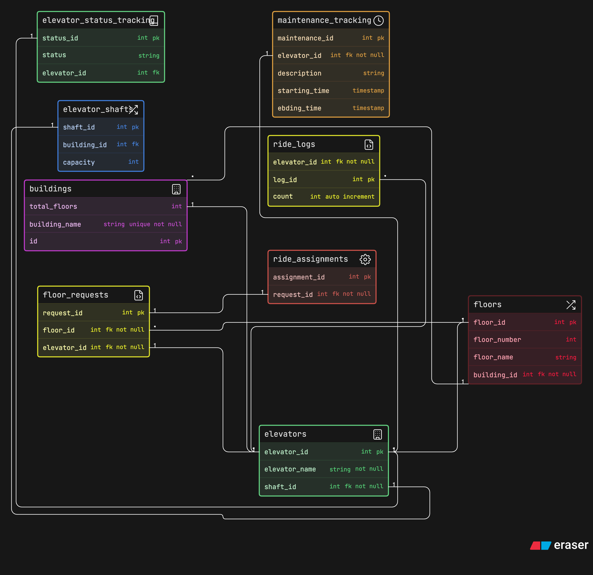

## Diagram



## Problem Statement

A fast-growing infrastructure technology company called LiftGrid Systems builds intelligent elevator control platforms for large commercial buildings across India.

Their software is used in corporate towers, malls, airports, hospitals and high-rise residential complexes where dozens of elevators operate together across many floors.

Unlike small standalone lifts, these buildings run multiple elevators per building, grouped into zones, handling thousands of passengers daily. The system must manage elevator assignments, floor requests, maintenance tracking and ride logs efficiently.

Each building can contain multiple elevator shafts. Each shaft contains one elevator. Each elevator moves across a defined set of floors and responds to ride requests generated by users from different floors.

The system should support:

- multiple buildings

- multiple elevators inside each building

- floor-level request tracking

- ride allocation to elevators

- elevator status monitoring

- maintenance tracking

- usage history logging

This backend platform helps operations teams monitor performance and ensures elevators remain safe, efficient and available.

This is a multi-building infrastructure management system handling real-time movement requests, elevator allocation and operational tracking.

## Entities and Relationships

### Entities

- buildings

- floors

- elevators

- elevator shafts (optional but recommended)

- floor requests

- ride assignments

- ride logs or trips

- elevator status tracking

- maintenance tracking

### Relationships

-  One building has multiple floors
   - `floors.building_id < buildings.id`
-  One building contains multiple elevetors
   -  `buildings.id < elevators.elevator_id`
-  Multiple elevator serves multiple floors
   -  `elevators.elevator_id <> floors.floor_id`
-  each elevator runs in own shaft
   -  `elevators.shaft_id - elevator_shafts.shaft_id`
-  one user can make multiple requests and gets assigned to one elevator 
   -  `floor_requests.floor_id > floors.floor_id`
   -  `floor_requests.elevator_id - elevators.elevator_id`
-  One request assigns one ride allocation
   -  `floor_requests.request_id - ride_assignments.request_id`
-  One elevator completes many rides daily
   -  `ride_logs.elevator_id > elevators.elevator_id`
-  Each elvator has its own tracking ID
   -  `elevators.elevator_id - elevator_status_tracking.status_id`
- Each elevator has its own maintainance 
  - `elevators.elevator_id - maintenance_tracking.elevator_id`

## Code

```sql
title Smart Elevator Control

buildings [icon: building, color: purple] {
  id int pk
  total_floors int
  building_name string unique not null
}

floors [icon: flow, color: pink] {
  floor_id int pk
  building_id int fk not null
  floor_number int
  floor_name string
}

// One building has multiple floors
floors.building_id < buildings.id 


elevators [icon: building, color: green] {
  elevator_id int pk
  elevator_name string not null
  shaft_id int fk not null
}

// One building contains multiple elevetors
buildings.id < elevators.elevator_id
// Multiple elevator serves multiple floors
elevators.elevator_id <> floors.floor_id


elevator_shafts [icon: flow, color: blue] {
  shaft_id int pk
  building_id int fk
  capacity int
}

// each elevator runs in own shaft
elevators.shaft_id - elevator_shafts.shaft_id


floor_requests [icon: log, color: yellow] {
  request_id int pk
  floor_id int fk not null
  elevator_id int fk not null
}
// one user can make multiple requests and gets assigned to one elevator 
floor_requests.floor_id > floors.floor_id
floor_requests.elevator_id - elevators.elevator_id

ride_assignments [icon: settings, color: red] {
  assignment_id int pk
  request_id int fk not null
}

// One request assigns one ride allocation
floor_requests.request_id - ride_assignments.request_id


ride_logs [icon: log, color: yellow] {
  log_id int pk
  elevator_id int fk not null
  count int auto increment
}
// One elevator completes many rides daily
ride_logs.elevator_id > elevators.elevator_id


elevator_status_tracking [icon: notebook, color: green] {
  status_id int pk
  status string 
  elevator_id int fk
}

// Each elvator has its own tracking ID
elevators.elevator_id - elevator_status_tracking.status_id


maintenance_tracking [icon: timer, color: orange] {
  maintenance_id int pk
  elevator_id int fk not null
  description string
  starting_time timestamp
  ebding_time timestamp
}

// Each elevator has its own maintainance 
elevators.elevator_id - maintenance_tracking.elevator_id


```
